Module 0: Introduction &  Lab Environment Orientation
=====================================================

This module kicks off our AppWorld *Code, Secure, Repeat - From AI Coding to Complete App Security Lab* and
is designed to get you oriented and comfortable in our hands-on lab environment.

Throughout this course we dive into essential technologies like:

* F5 Distributed Cloud (including vK8s, WAAP, and WAS)
* VSCode Server enhanced by the Cline extension
* GitLab CE for CI/CD
* Terraform with the volterraedge provider
* Python

In this module, you'll verify access to key tools: starting with VSCode Server for coding, GitLab for version control, and your F5 Distributed Cloud tenant for security.
We'll also confirm pre-built objects like namespaces and clusters, capture your unique namespace, and generate an API token to streamline automation.

Follow the steps closely—images are provided for guidance—and let's ensure everything's set up smoothly so you're ready to build and secure apps in the modules ahead. 

+----------------------------------------------------------------------------------------------+
| **Beginning of Lab:**  Let's get started!  Ask questions as needed.                          |
+----------------------------------------------------------------------------------------------+
| |labbgn|                                                                                     |
+----------------------------------------------------------------------------------------------+

**Expected Lab Time: 20 minutes**

Task 1: Verify Lab Component Access
~~~~~~~~~~~~~~~~~~~~~~~~~~~~~~~~~~~~

For this task we will explore and verify access Visual Studio Code, in later modules we will work within
VSCode and use AI to vibe code our application.

+----------------------------------------------------------------------------------------------+
| 1. First up locate  the **Jump Host** resource and click **Access**  then **VSCODE**         |
|                                                                                              |
| |vscode1|                                                                                    |
+----------------------------------------------------------------------------------------------+
|                                                                                              |
| 2. Now enter the password *AppWorld2026!* and Click **Submit**  to login to VSCode           |
|                                                                                              |
| |vscode2|                                                                                    |
+----------------------------------------------------------------------------------------------+

+----------------------------------------------------------------------------------------------+
|                                                                                              |
| 3. This brings us to the VSCode walkthrough screen, to your left is the Cline extenstion, on |
|                                                                                              |
|    the right a AI assisted build agent.  Center screen is where you can adjust color         |
|                                                                                              |
|    preference, pick a color scheme and click **Mark Done** when your customizations are      |
|                                                                                              |
|    complete.                                                                                 |
| |vscode3|                                                                                    |
+----------------------------------------------------------------------------------------------+

.. note::
   *Students may see a this pop-up below, if you do simply click Allow*

+----------------------------------------------------------------------------------------------+
| |vscode4|                                                                                    |
+----------------------------------------------------------------------------------------------+

+----------------------------------------------------------------------------------------------+
| 4. Lets close the VSCode AI code assistant by clicking the "X" in the upper right hand corner|
|                                                                                              |
| |vscode5|                                                                                    | 
|                                                                                              |
+----------------------------------------------------------------------------------------------+
| 5.  Finally lets close the walkthrough screen by click on the "X"                            |
|                                                                                              |
| |vscode6|                                                                                    |
+----------------------------------------------------------------------------------------------+

+----------------------------------------------------------------------------------------------+
|                                                                                              |
| 6. Placed Holder for Gitlab Server Access (browser based)                                    |
| |task1-xx|                                                                                   |
|                                                                                              |
+----------------------------------------------------------------------------------------------+

For now we are finished working with VSCode and we can turn our attention to getting F5 Distributed Cloud tenant access verified

The following steps will guide you through the initial setup to access the Distributed Cloud Console and complete user access
customizations.  We will then verify pre-configured objects such as Namespaces, CE's, Virtual Sites and the vk8's clusters.  These
objects have been automatically created.  Namespaces are individual to each lab student and contain specific configuration objects.  
CE's know as customer edges nodes enable Distributed Cloud to extend to any edge location and provide the same SaaS services as within 
the global platform.  Virtual Sites are logically grouped sites across any edge location's and vk8's are virtual kubernetes services 
for app deployment.  Distributed Cloud Credential API Tokens are used to make API calls to the platform, these need to be manually generated.

You should have received an email with an invitation to access a F5 Distributed Cloud Tenant. The email will come 
from **no-reply@cloud.f5.com**.  Please check the email address used for course registration and its associated spam 
folders to see if the invitation email has been received. If you have not received an email, please contact a
memberof the lab team.

.. note::
     *F5 Distributed Cloud Console: https://f5-xc-lab-app.console.ves.volterra.io/*

 

+----------------------------------------------------------------------------------------------+
| 1. Lets grab that email and click **Accept Invitation**                                      |
|                                                                                              |
+----------------------------------------------------------------------------------------------+
| |xc1|                                                                                        |
|                                                                                              |
+----------------------------------------------------------------------------------------------+
| 2. This should bring you to the sign-in screen below, Click **Sign In with Okta**            |
|                                                                                              |
+----------------------------------------------------------------------------------------------+
| |xc2|                                                                                        |
|                                                                                              |
+----------------------------------------------------------------------------------------------+
| 3.  When you first login, accept the Lab tenant EULA. Click the check box and then click     |
|                                                                                              |
|     **Accept and Agree**.                                                                    |
+----------------------------------------------------------------------------------------------+
| |xc3|                                                                                        |
|                                                                                              |
+----------------------------------------------------------------------------------------------+
| 4. Select **Super User** domain role and click **Next** to see various configuration options.|
|                                                                                              |
|    Roles can be changed any time later if desired.                                           |
|                                                                                              |
+----------------------------------------------------------------------------------------------+
|                                                                                              |
| |xc4|                                                                                        |
|                                                                                              |
+----------------------------------------------------------------------------------------------+
| 5. Click the **Advanced** skill level to expose more menu options and then click **Get**     |
|                                                                                              |
|    **Started** to begin. You can change this setting after logging in as well.               |
+----------------------------------------------------------------------------------------------+
|                                                                                              |
| |xc5|                                                                                        |
|                                                                                              |
+----------------------------------------------------------------------------------------------+
| 6. Namespaces, which provide an environment for isolating configured applications or         |
|                                                                                              |
|    enforcing role-based access controls, are leveraged within the F5 Distributed Cloud       |
|                                                                                              |
|    Console.  For the purposes of this lab, each lab attendee has been provided a unique      |
|                                                                                              |
|    **namespace** which you will be defaulted to (in terms of GUI navigation) for all tasks   |
|                                                                                              |
|    performed through the course of this lab.  To locate your specific namespace on the main  |
|                                                                                              |
|    screen below click the **profile**  icon in the upper right hand corner then select       |
|                                                                                              |
|    **Account Settings**                                                                      |
+----------------------------------------------------------------------------------------------+
|                                                                                              |
| |xc6|                                                                                        |
|                                                                                              |
+----------------------------------------------------------------------------------------------+
| 7. Under personal management now click **My Namespaces**                                     |
|                                                                                              |
+----------------------------------------------------------------------------------------------+
|                                                                                              |
| |xc7|                                                                                        |
|                                                                                              |
+----------------------------------------------------------------------------------------------+
| 8. To the the right you will see a unique **Namespace** assigned specifically to you, keep   |
|                                                                                              |
|    note of this as you will use this throught the remaining labs                             |
+----------------------------------------------------------------------------------------------+
|                                                                                              |
| |xc8|                                                                                        |
|                                                                                              |
+----------------------------------------------------------------------------------------------+

+----------------------------------------------------------------------------------------------+
| 9. Generating a API Token is under your profile begin by click the **profile**  icon in the  | 
|                                                                                              |
|    upper right hand corner then select **Account Settings**                                  |
|                                                                                              |
| |xc6|                                                                                        |
|                                                                                              |
+----------------------------------------------------------------------------------------------+
| 10. Under **Personal Management** Click **Credentials** then **Add Credentials**             | 
|                                                                                              |
| |xc13|                                                                                       |
|                                                                                              |
+----------------------------------------------------------------------------------------------+
| 11. Use the following values:                                                                | 
|                                                                                              |
|    **Credential Name:** *your-namespace-token*                                               |
|                                                                                              |
|    **Credential Type:** *API Token*                                                          |
|                                                                                              |
|    **Expiry Date:** *Any Future Date*                                                        |
|                                                                                              |
|                                                                                              |
| |xc14|                                                                                       |
|                                                                                              |
+----------------------------------------------------------------------------------------------+

+----------------------------------------------------------------------------------------------+
| 12. Click **Generate** at the bottom of the window and take note of the API Token value.     | 
|                                                                                              |
|    This will only appear once so copy and store otherwise you will need to either delete and |
|                                                                                              |
|    create a new API Token if you lose this key.  Store it we will need it for the next task  |
|                                                                                              |
| |xc15|                                                                                       |
+----------------------------------------------------------------------------------------------+

Great! Now that we have taken care of some of the inital configurations lets finish up the rest in Task 2.

Task 2: Configure Cline Extension and GITLAB environment 
~~~~~~~~~~~~~~~~~~~~~~~~~~~~~~~~~~~~~~~~~~~~~~~~~~~~~~~~

Hey there, future app innovators! Dive into this essential setup task to supercharge your VSCode with the 
Cline extension powered by Gemini and integrate GitLab with your F5XC API token for seamless automation.
You'll configure Cline by selecting GCP Vertex AI as the provider and the gemini-2.5-flash model, then 
test it with a fun welcome prompt to verify connectivity. Next, set up GitLab to use your API token and 
confirm everything's linked up.  With guided steps and images to help, this quick config will have you 
ready for AI-assisted coding and CI/CD workflows. Let's make your environment vibe!

+----------------------------------------------------------------------------------------------+
| 1. Locate  the **Jump Host** resource and click **Access**  then **VSCODE**                  |
|                                                                                              |
| |vscode1|                                                                                    |
+----------------------------------------------------------------------------------------------+
| 2. Look to the leftmost side and locate the Cline icon as indicated below                    |
|                                                                                              |
|                                                                                              |
|  |cline1|                                                                                    |
|                                                                                              |
+----------------------------------------------------------------------------------------------+
| 3. Select **Bring my own API Key** and Click Continue                                        |
|                                                                                              |
| |cline2|                                                                                     |
+----------------------------------------------------------------------------------------------+
| 4. Configure the Provider with the following values then click **Continue**                  |
|                                                                                              |
|    **API Provider:** *GCP Vertex AI*                                                         |
|                                                                                              |
|    **Model:** *gemini-2.5-flash*                                                             |
|                                                                                              |
| |cline3|                                                                                     |
+----------------------------------------------------------------------------------------------+
| 5. When configured you should see the popup, close it by clicking "X"                        |
|                                                                                              |
| |cline4|                                                                                     |
|                                                                                              |
+----------------------------------------------------------------------------------------------+
| 6. You can expand the Cline extension window by clicking the divider line and drag it        |
|                                                                                              |
|    Now you can work with the welcome prompt, lets copy and paste the following               |
|                                                                                              |
|    **Hi Gemini!! Welcome to AppWorld 2026!! We are going to have fun vibe coding !!**        |
|                                                                                              |
|   Then click on **Act** as indicated below                                                   |
|                                                                                              |
| |cline5|                                                                                     |
+----------------------------------------------------------------------------------------------+
| 7. We can see the task was successfully processed, check it out below !                      |
|                                                                                              |
| |cline6|                                                                                     |
+----------------------------------------------------------------------------------------------+

+----------------------------------------------------------------------------------------------+
| **End of Lab:** Nice Job! Its time to move on to the next module!                            |
+----------------------------------------------------------------------------------------------+
| |labend|                                                                                     |
+----------------------------------------------------------------------------------------------+

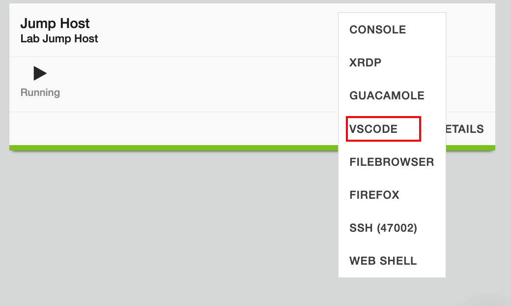
.. |vscode2| image:: ../_static/vscode2.png
   :width: 800px
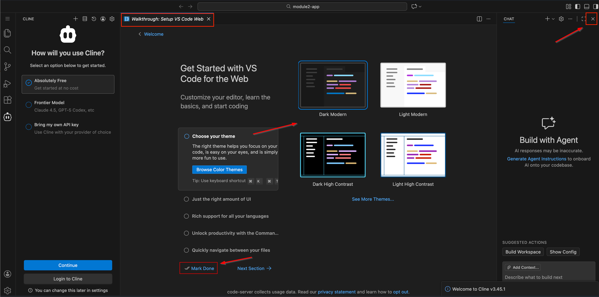
.. |vscode4| image:: ../_static/vscode4.png
   :width: 400px
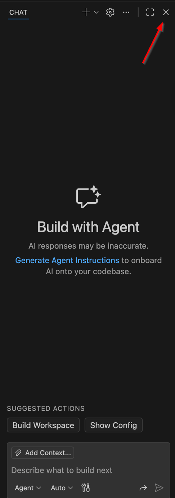
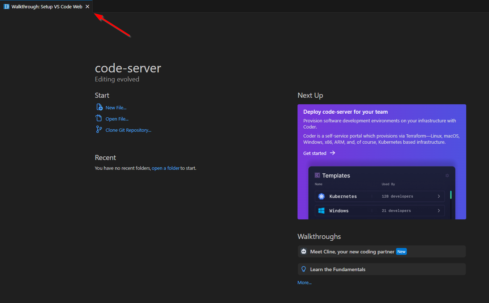
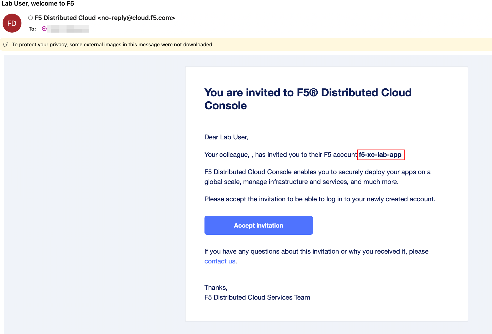
.. |xc2| image:: ../_static/xc2.png
   :width: 800px
.. |xc3| image:: ../_static/xc3.png
   :width: 800px
.. |xc4| image:: ../_static/xc4.png
   :width: 800px
.. |xc5| image:: ../_static/xc5.png
   :width: 800px
.. |xc6| image:: ../_static/xc6.png
   :width: 800px
.. |xc7| image:: ../_static/xc7.png
   :width: 800px
.. |xc8| image:: ../_static/xc8.png
   :width: 800px
.. |xc13| image:: ../_static/xc13.png
   :width: 600px
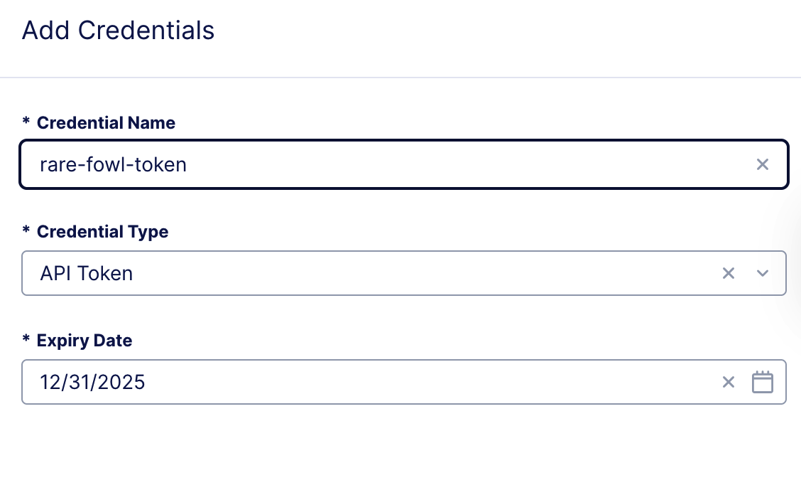
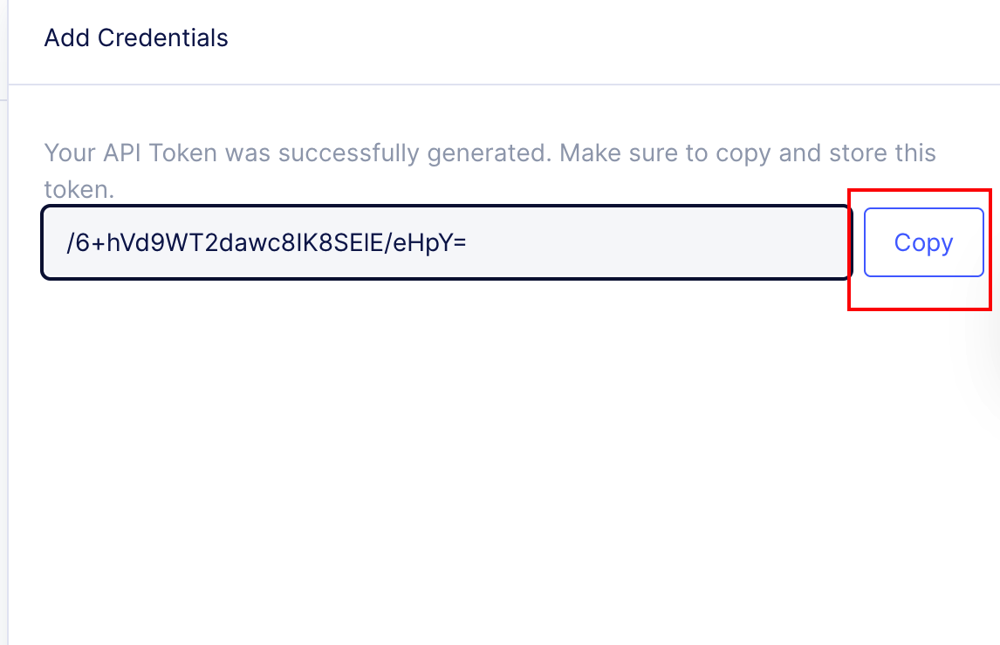
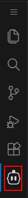
.. |cline2| image:: ../_static/cline2.png
   :width: 800px
.. |cline3| image:: ../_static/cline3.png
   :width: 800px
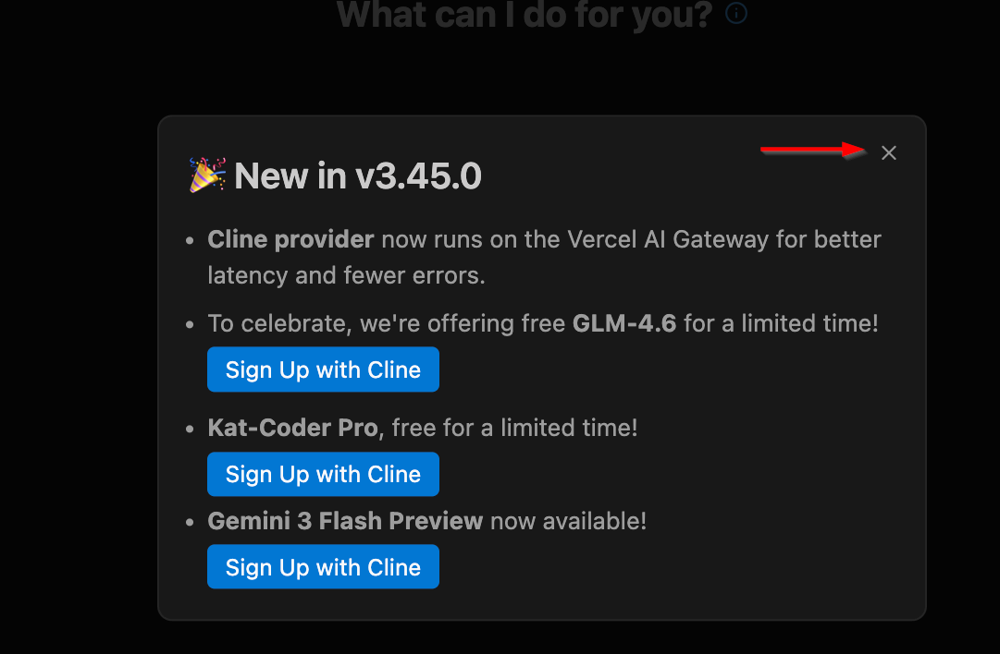
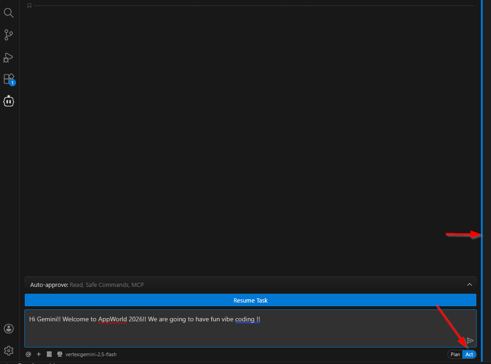
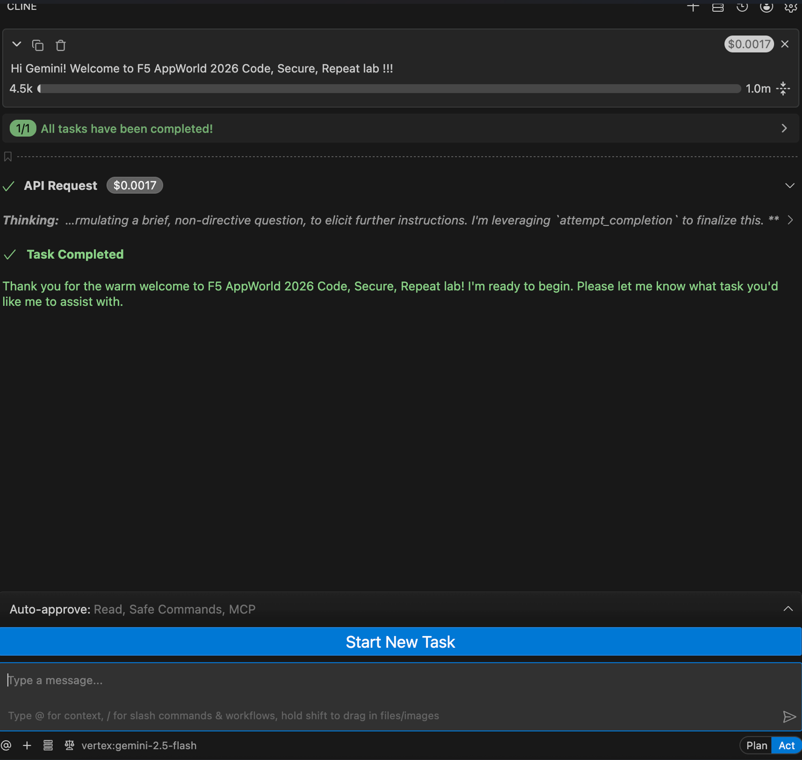
.. |labbgn| image:: ../_static/labbgn.png
   :width: 800px
.. |labend| image:: ../_static/labend.png
   :width: 800px
