Module 0: Introduction &  Lab Environment Orientation
=====================================================

Welcome to this *Code, Secure, Repeat - From AI Coding to Complete App Security Lab*.  The 
following tasks will guide you through verfiying and getting familiar with the lab's initial
access requirements.  

The majority of the lab task will be conducted using Visual Studio Code Server from the Jumphost resource 
along with the F5 Distributed Cloud Console. F5 Distributed Cloud is a SaaS based control-plane for
services which provides a GUI and API for managing network, security, and compute services. Web App 
Scanning (WAS) will be utilized to demonstrate vulnerabilities in our AI assisted and Vibe coded application.

+----------------------------------------------------------------------------------------------+
| **Beginning of Lab:**  You are now ready to begin the lab, Enjoy! Ask questions as needed.   |
+----------------------------------------------------------------------------------------------+
| |labbgn|                                                                                     |
+----------------------------------------------------------------------------------------------+

+----------------------------------------------------------------------------------------------+
| Lab attendees will interact and explore the following resources for the next two tasks       |
|                                                                                              |
| * **F5 Distributed Cloud Tenant (CE's , vK8's, API Credentials)**                            |
| * **Visual Studio Code Server (browser-based)**                                              |
| * **GitLab Community Edition (CE)**                                                          | 
| * **Cline Extension**                                                                        |
|                                                                                              |
+----------------------------------------------------------------------------------------------+

Lets get started!

**Expected Lab Time: 20 minutes**

Task 1: Verify Lab Component Access
~~~~~~~~~~~~~~~~~~~~~~~~~~~~~~~~~~~~

For this task we will explore and verify access to each component that we will use throughout the course.

+----------------------------------------------------------------------------------------------+
| 1. First up locate  the **Jump Host** resource and click **Access**  then **VSCODE**         |
|                                                                                              |
| |task1-01|                                                                                   |
+----------------------------------------------------------------------------------------------+
|                                                                                              |
| 2. Now enter the password *AppWorld2026!* and Click **Submit**                               |
|                                                                                              |
| |task1-02|                                                                                   |
+----------------------------------------------------------------------------------------------+

+----------------------------------------------------------------------------------------------+
|                                                                                              |
| 3. Walk through setting up your color scheme in VSCode, select a color scheme                |
| and Click **Mark Done**                                                                      |
|                                                                                              |
| |task1-03|                                                                                   |
+----------------------------------------------------------------------------------------------+

+----------------------------------------------------------------------------------------------+
| 4. You will aslo notice to the far right an AI assisted Build Agent, you can click the "X"   |
| in the corner to close this out.  (See Image Above for location                              |
|                                                                                              |
| |task1-04|                                                                                   |
+----------------------------------------------------------------------------------------------+

+----------------------------------------------------------------------------------------------+
|                                                                                              |
| 5. Placed Holder for Gitlab Community Edition CE                                             |
| |task1-xx|                                                                                   |
+----------------------------------------------------------------------------------------------+

Now we will work on verifying F5 Distributed Cloud tenant access and pre-configured objects needed 
for the remainder of the labs.

The following will guide you through the initial Lab environment access within the F5 Distributed
Cloud Console.  You should have received an email with an invitation to access a F5 Distributed
Cloud Tenant. The email will come from **no-reply@cloud.f5.com**.

The name of the F5 Distributed Cloud tenant that we will be using for this lab is **f5-xc-lab-app**
Additionally, the following are key configuration elements for this lab and will be used
throughout the lab tasks that follow.

* F5 Distributed Cloud Console: https://f5-xc-lab-app.console.ves.volterra.io/
* Delegated Domain: **lab-app.f5demos.com**

After following the invitation email's instructions to **Update Password**, proceed to the first
step below to access the F5 Distributed Cloud Lab Tenant. 

Lab attendees should have received an invitation 
(which requests you update your password for access) email to the lab environment. Please check 
the email address used for course registration and its associated spam folders to see if the
invitation email has been received.  If you have not received an email, please contact a member
of the lab team.

+----------------------------------------------------------------------------------------------+
| 1. Lets grab that email and click **Accept Invitation**                                      |
|                                                                                              |
+----------------------------------------------------------------------------------------------+
| |task1-05|                                                                                   |
|                                                                                              |
+----------------------------------------------------------------------------------------------+
| 2. This should bring you to the sign-in screen below                                         |
|                                                                                              |
+----------------------------------------------------------------------------------------------+
| |task1-06|                                                                                   |
|                                                                                              |
+----------------------------------------------------------------------------------------------+
| 3.  When you first login, accept the Lab tenant EULA. Click the check box and then click     |
|                                                                                              |
|     **Accept and Agree**.                                                                    |
+----------------------------------------------------------------------------------------------+
| |task1-07|                                                                                   |
|                                                                                              |
+----------------------------------------------------------------------------------------------+
| 4. Select **Super User** domain role and click **Next** to see various configuration options.|
|                                                                                              |
|    Roles can be changed any time later if desired.                                           |
|                                                                                              |
+----------------------------------------------------------------------------------------------+
|                                                                                              |
| |task1-08|                                                                                   |
|                                                                                              |
+----------------------------------------------------------------------------------------------+
| 5. Click the **Advanced** skill level to expose more menu options and then click **Get**     |
|                                                                                              |
|    **Started** to begin. You can change this setting after logging in as well.               |
+----------------------------------------------------------------------------------------------+
|                                                                                              |
| |task1-09|                                                                                   |
|                                                                                              |
+----------------------------------------------------------------------------------------------+
| 6. Namespaces, which provide an environment for isolating configured applications or         |
|                                                                                              |
|    enforcing role-based access controls, are leveraged within the F5 Distributed Cloud       |
|                                                                                              |
|    Console.  For the purposes of this lab, each lab attendee has been provided a unique      |
|                                                                                              |
|    **namespace** which you will be defaulted to (in terms of GUI navigation) for all tasks   |
|                                                                                              |
|    performed through the course of this lab.  To locate your specific namespace on the main  |
|                                                                                              |
|    screen below click the **profile**  icon in the upper right hand corner then select       |
|                                                                                              |
|    **Account Settings**                                                                      |
+----------------------------------------------------------------------------------------------+
|                                                                                              |
| |task1-10|                                                                                   |
|                                                                                              |
+----------------------------------------------------------------------------------------------+
| 7. Under personal management now click **My Namespaces**                                     |
|                                                                                              |
+----------------------------------------------------------------------------------------------+
|                                                                                              |
| |task1-11|                                                                                   |
|                                                                                              |
+----------------------------------------------------------------------------------------------+
| 8. To the the right you will see a unique **Namespace** assigned specifically to you, keep   |
|                                                                                              |
|    note of this as you will use this throught the remaining labs                             |
+----------------------------------------------------------------------------------------------+
|                                                                                              |
| |task1-12|                                                                                   |
|                                                                                              |
+----------------------------------------------------------------------------------------------+

Great! Now that we have taken care of some of the inital configurations lets finish up the rest in Task 2.

Task 2: Configure Cline Extension and GITLAB environment 
~~~~~~~~~~~~~~~~~~~~~~~~~~~~~~~~~~~~~~~~~~~~~~~~~~~~~~~~

In this task we will finish setting up the Cline Extension and GITLAB environments so we can start
our  AI-assisted and Vibe coding journey.

+----------------------------------------------------------------------------------------------+
| 1. Locate  the **Jump Host** resource and click **Access**  then **VSCODE**                  |
|                                                                                              |
| |task1-01|                                                                                   |
+----------------------------------------------------------------------------------------------+
| 2. Look to the leftmost side and locate the Cline icon as indicated below                    |
|                                                                                              |
|  |task2-01|                                                                                  |
|                                                                                              |
+----------------------------------------------------------------------------------------------+
| 3. Select **Bring my own API Key** and Click Continue                                        |
|                                                                                              |
| |task2-02|                                                                                   |
+----------------------------------------------------------------------------------------------+
| 4. Configure the Provider with the following values then click **Continue**                  |
|                                                                                              |
|    **API Provider:** *GCP Vertex AI*                                                         |
|                                                                                              |
|    **Google Cloud Project ID:** *vscode-xxxxxx*                                              |
|                                                                                              |
|    **Google Cloud Region:** *us-central1*                                                    |
|                                                                                              |
|    **Model:** *gemini-2.5-flash*                                                             |
|                                                                                              |
| |task2-03|                                                                                   |
+----------------------------------------------------------------------------------------------+
| 5. When successfully configured you should see the following                                 |
|                                                                                              |
| |task2-04|                                                                                   |
|                                                                                              |
+----------------------------------------------------------------------------------------------+

Before we can complete the GITLAB setup we need to generate an API token from F5 Distributed Cloud.
Let's head back in and take care of this!

+----------------------------------------------------------------------------------------------+
| 1. Generating a API Token is under your profile begin by click the **profile**  icon in the  | 
|                                                                                              |
|    upper right hand corner then select **Account Settings**                                  |
|                                                                                              |
| |task1-10|                                                                                   |
|                                                                                              |
+----------------------------------------------------------------------------------------------+
| 2. Under **Personal Management** Click **Credentials** then **Add Credentials**              | 
|                                                                                              |
| |task2-05|                                                                                   |
|                                                                                              |
+----------------------------------------------------------------------------------------------+
| 3. Use the following values:                                                                 | 
|                                                                                              |
|    **Credential Name:** *your-namespace-token*                                               |
|                                                                                              |
|    **Credential Type:** *API Token                                                           |
|                                                                                              |
|    **Expiry Date:** *Any Future Date*                                                        |
|                                                                                              |
|                                                                                              |
| |task2-06|                                                                                   |
|                                                                                              |
+----------------------------------------------------------------------------------------------+

+----------------------------------------------------------------------------------------------+
| 4. Click **Generate** at the bottom of the window and take note of the API Token value.      | 
|                                                                                              |
|    This will only appear once so copy and store otherwise you will need to either delete and |
|                                                                                              |
|    create a new API Token if you lose this key.                                              |
|                                                                                              |
| |task2-07|                                                                                   |
+----------------------------------------------------------------------------------------------+

+----------------------------------------------------------------------------------------------+
| **End of Lab:** Nice Job! Its time to get hands on with AI Coding to Complete App Security!  |
+----------------------------------------------------------------------------------------------+
| |labend|                                                                                     |
+----------------------------------------------------------------------------------------------+

.. |task1-01| image:: ../_static/task1-01.png
   :width: 800px
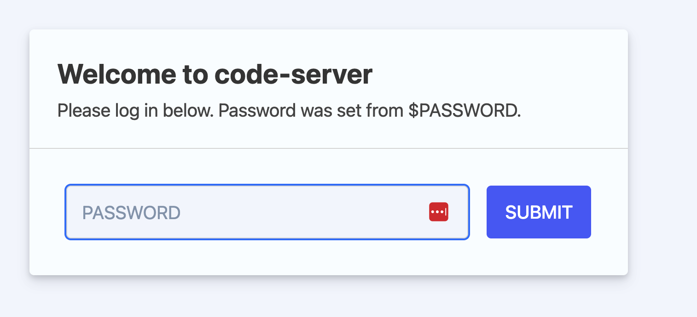
.. |task1-03| image:: ../_static/task1-03.png
   :width: 800px
.. |task1-04| image:: ../_static/task1-04.png
   :width: 500px
.. |task1-05| image:: ../_static/task1-05.png
   :width: 800px
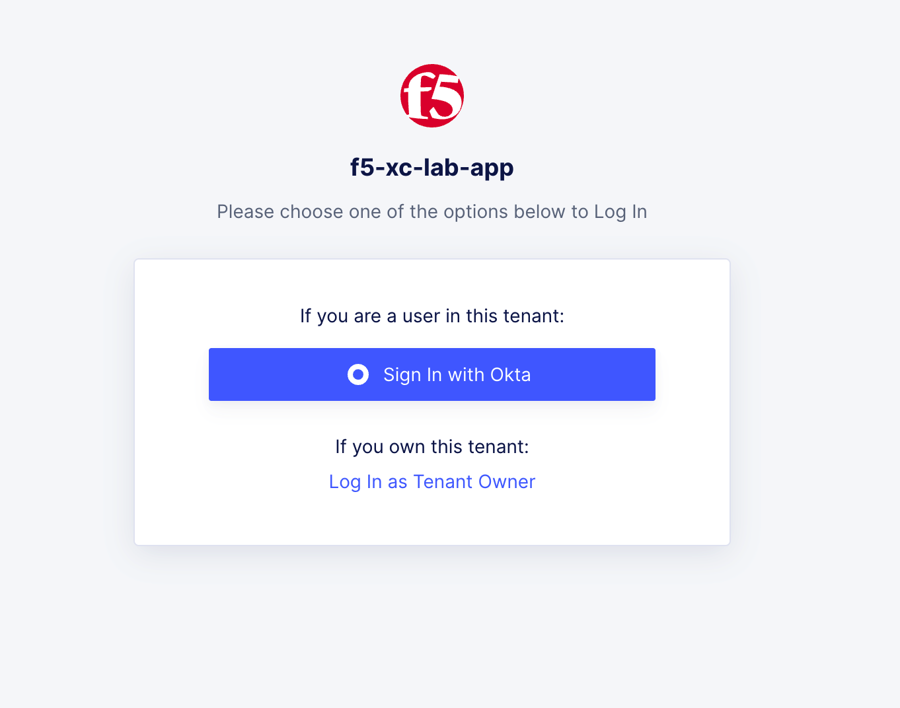
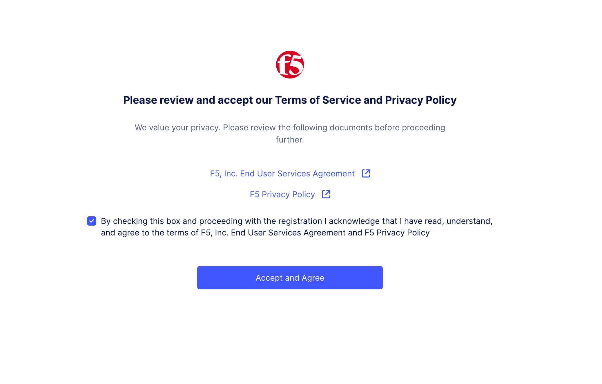
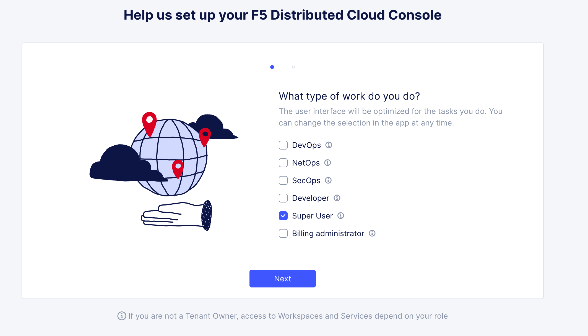
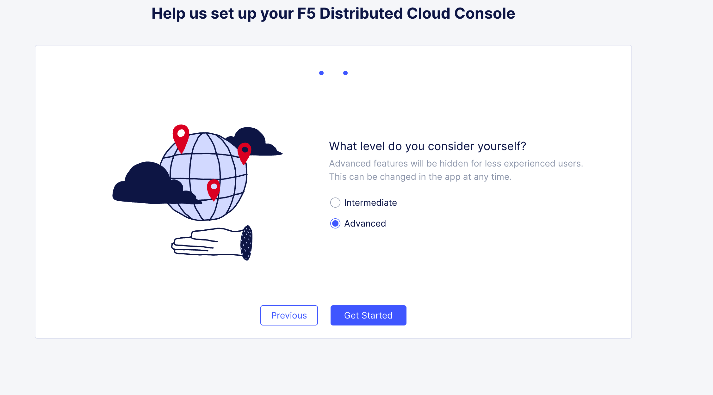
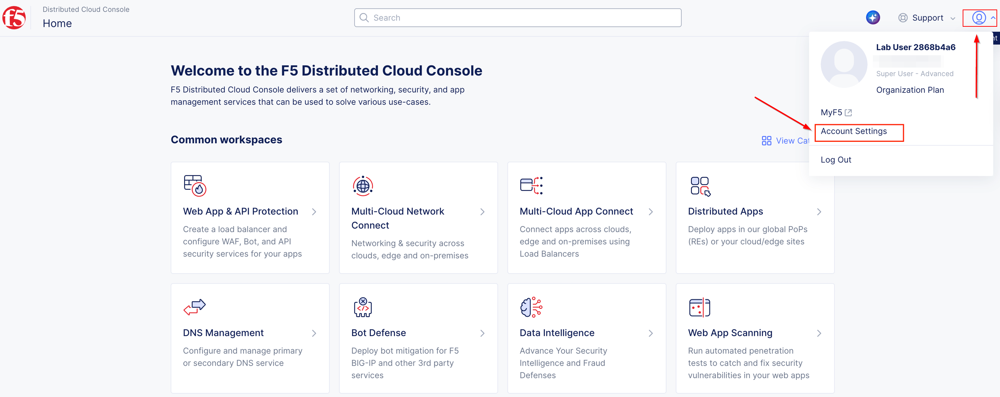
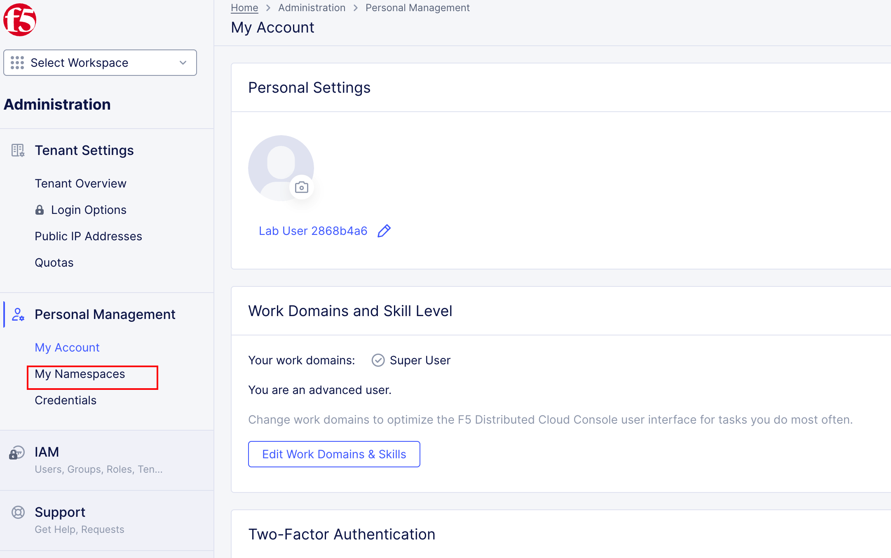
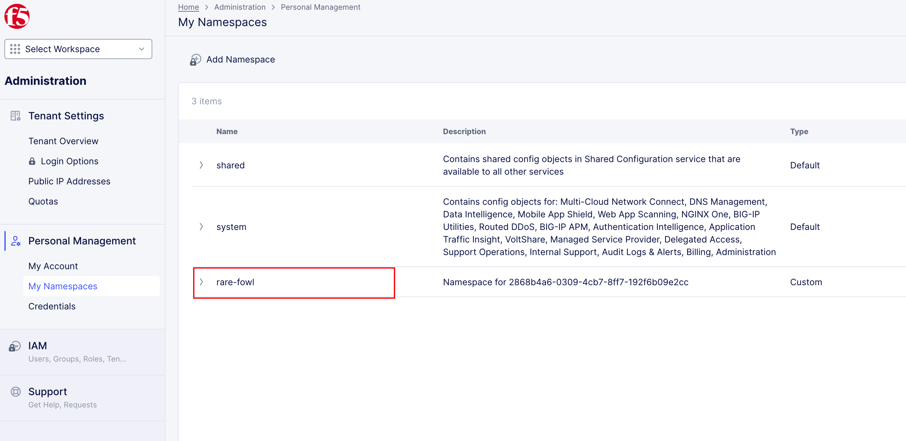
.. |task2-01| image:: ../_static/task2-01.png
   :width: 300px
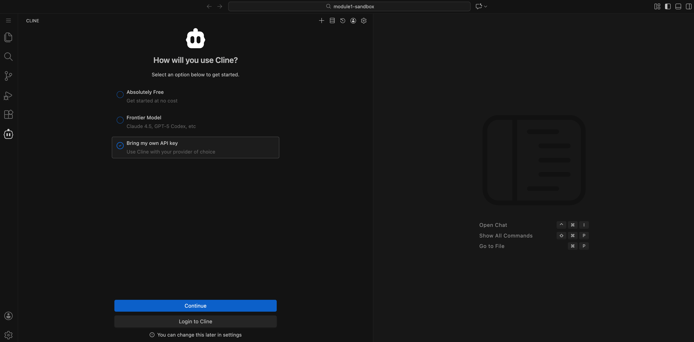
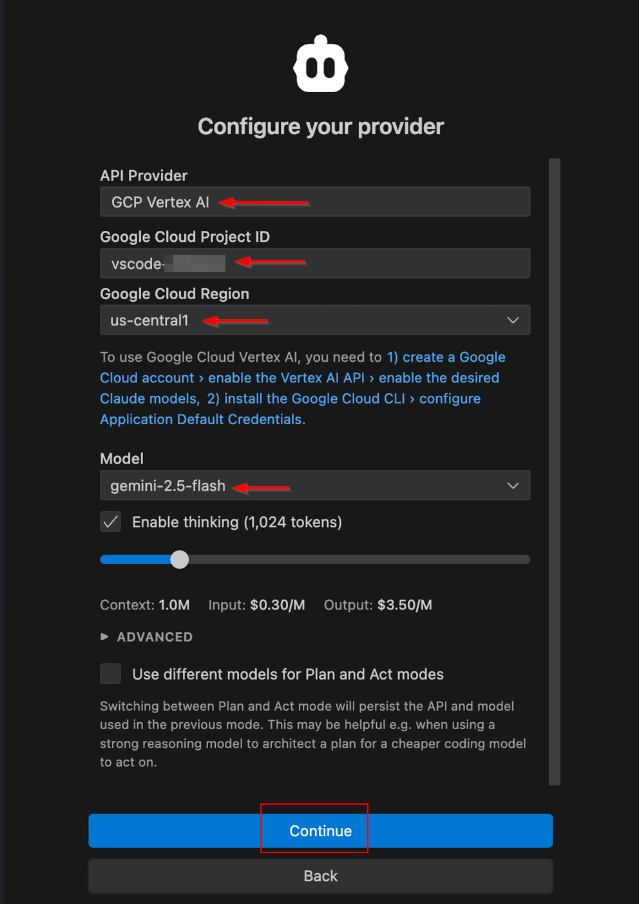
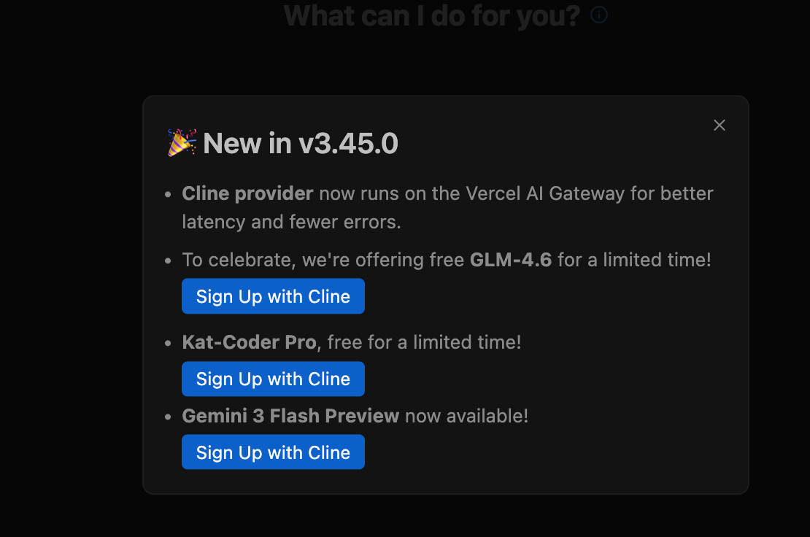
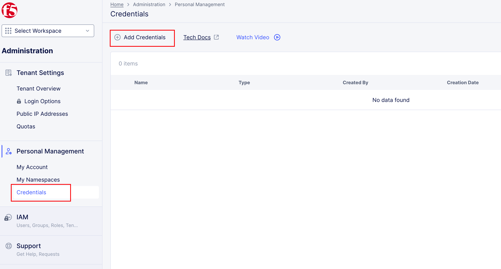
.. |task2-06| image:: ../_static/task2-06.png
   :width: 600px
.. |task2-07| image:: ../_static/task2-07.png
   :width: 600px

