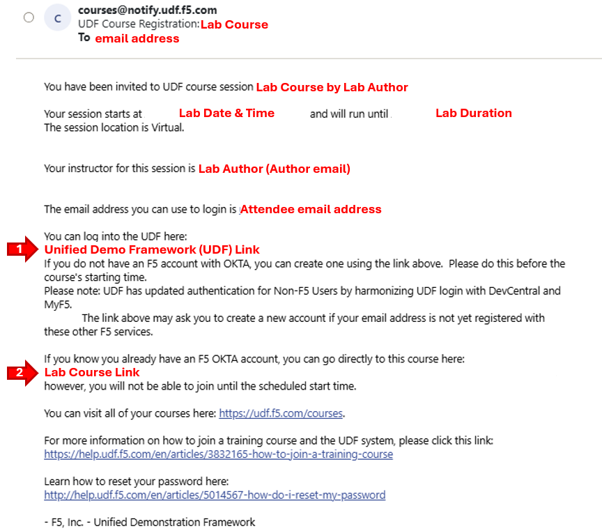

Placeholder
=====================================

Module 1 Task1

Task 1: – Explore VScode and Client Extension
~~~~~~~~~~~~~~~~~~~~~~~~~~~~~~~~~~~~~~~~~~~~~~

+----------------------------------------------------------------------------------------------+
| The images below represents an overview of the lab environment. F5 Distributed Cloud Services|
|                                                                                              |
| will be configured as a SaaS Edge delivery and security service tier to a publicly hosted web|
|                                                                                              |
| application. The key elements lab attendees will interact with are as follows:               |
|                                                                                              |
| * **F5 Distributed Cloud Tenant (WAAP,API Security, WAS, vK8's**                             |
| * **Visual Studio Code Server (browser-based)**                                              |
| * **GitLab Community Edition (CE)**                                                          |
| * **Terraform CLI inside VSCode Server**                                                     |
|                                                                                              |
| Lets grab that email and get logged in!                                                      |
+----------------------------------------------------------------------------------------------+
| |intro001|                                                                                   |
+----------------------------------------------------------------------------------------------+

